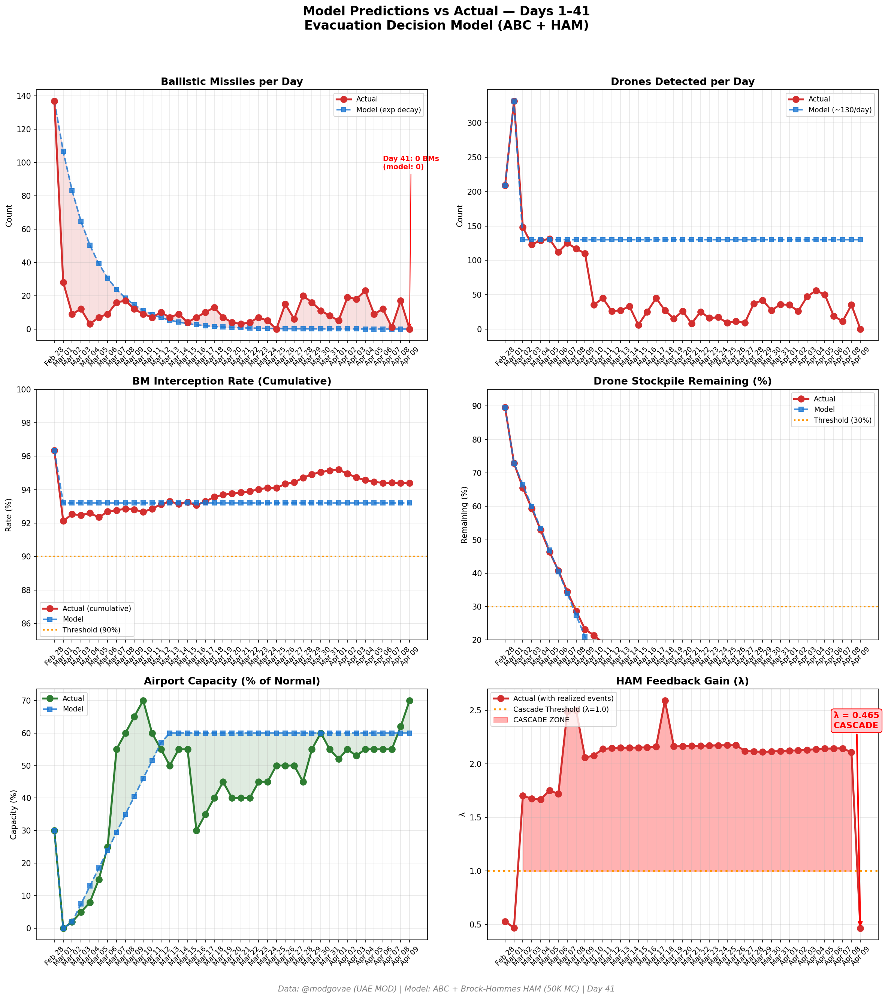
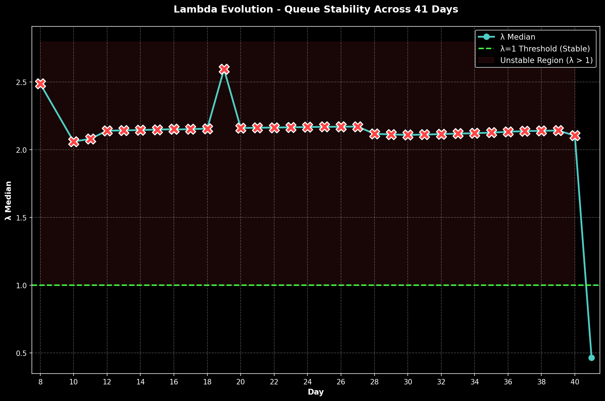

# 第41天更新 — 2026年4月9日

> 🌐 [English](../../updates/day41-april9.md) | **中文**

**状态：亚稳态** | **突破：2/5** | **λ中位数 = 0.463**

---

## 新数据

| 指标 | 第40天 | 第41天 | 累计 |
|------|-------|-------|------|
| 弹道导弹 | 17 | **0** | **536** |
| 弹道导弹拦截 | 16 | 0 | 506 |
| 无人机探测 | 35 | ~0 | ~2362 |
| 无人机拦截 | 33 | 0 | ~2172 |
| 巡航导弹 | 0 | 0 | 19 |
| 弹道导弹拦截率（累计） | — | — | 94.4% |
| 无人机库存剩余 | — | — | -18.1%（-362/2000） |

**关键事件：**
- Day 1 of US-Iran 2-week ceasefire (brokered by Pakistan, announced Apr 8)
- First day with zero missile/drone attacks since conflict began Feb 28
- Chinese tankers queue at Hormuz to test passage; full traffic not yet resumed
- EASA airspace advisory valid until Apr 10; decision pending
- WTI rebounds to 101.28 as Iran threatens Hormuz re-closure if ceasefire violated
- Ceasefire extension to Apr 21 at 71% on Polymarket; breakdown by Apr 14 at 18%
- UAE Mirage jets suspected in post-ceasefire strike on Iranian refinery (Lavan Island)
- Islamabad peace negotiations begin Friday between US and Iran

---

## Lambda重新计算

```
λ = 1.0
  + λ_发射装置         = -0.544
  + λ_无人机          = +0.236
  + λ_拦截           = +0.000
  + λ_霍尔木兹         = +0.000
  + λ_代理人          = +0.000
  + λ_武器           = +0.000
  + λ_弹道反弹         = +0.000
  + λ_海军威慑         = -0.240
  ────────────────────────────
  λ 中位数       = 0.463（50K蒙特卡罗）
```

| 指标 | 数值 |
|------|------|
| λ 中位数 | **0.463** |
| λ 第95百分位 | **1.010** |
| P(λ > 1.0) | **5.1%** |
| P(λ > 1.5) | **2.0%** |
| P(λ > 2.0) | **0.3%** |
| 判定 | **亚稳态** |
| 突破数 | **2/5** |

---

## 图表





---

## 建议

**监测。** 系统在正常参数范围内。

---

## 数据来源

| 来源 | 类型 |
|------|------|
| @modgovae (X.com) | 阿联酋国防部每日更新 |
| 模型管线 | ABC + HAM (50K MC) |
| 生成时间 | 2026-04-09 23:25 |
