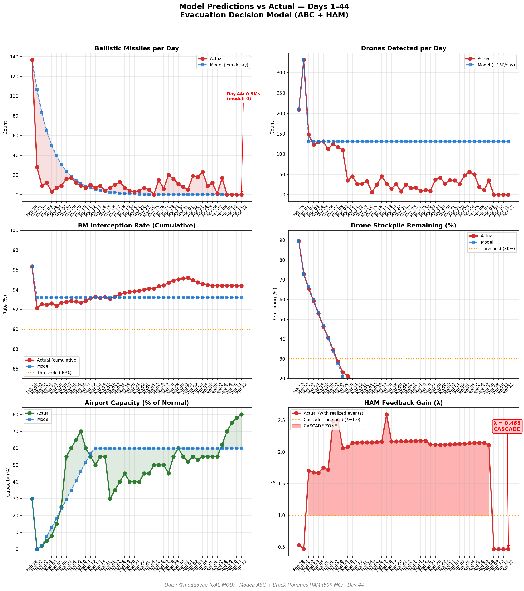
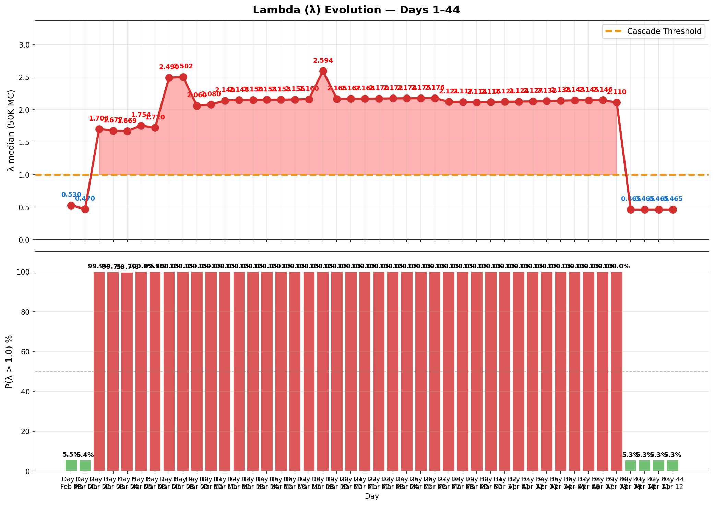

# 第44天更新 — 2026年4月12日

> 🌐 [English](../../updates/day44-april12.md) | **中文**

**状态：亚稳态** | **突破：2/5** | **λ中位数 = 0.463**

---

## 新数据

| 指标 | 第43天 | 第44天 | 累计 |
|------|-------|-------|------|
| 弹道导弹 | 0 | **0** | **536** |
| 弹道导弹拦截 | 0 | 0 | 506 |
| 无人机探测 | 0 | ~0 | ~2362 |
| 无人机拦截 | 0 | 0 | ~2172 |
| 巡航导弹 | 0 | 0 | 19 |
| 弹道导弹拦截率（累计） | — | — | 94.4% |
| 无人机库存剩余 | — | — | -18.1%（-362/2000） |

**关键事件：**
- Ceasefire Day 4: Fourth consecutive zero-attack day; no BMs, drones, or cruise missiles detected by @modgovae
- ISLAMABAD TALKS COLLAPSE: VP JD Vance announces negotiations with Iran have failed after day of talks in Islamabad — unable to reach agreement on key issues (Hormuz control, Lebanon truce, Iranian asset unfreezing). Vance: 'Iran was not willing to meet us halfway' (CNBC, Al Jazeera, CNN)
- TRUMP ANNOUNCES NAVAL BLOCKADE: Following talks failure, Trump declares US naval blockade of Strait of Hormuz effective April 13 10 AM ET — US Navy will 'prevent any and all ships from entering or exiting' Iranian ports; ships that paid Iran tolls will be intercepted (CNBC, Fortune, Al Jazeera)
- Iran warns Hormuz could become 'whirlpool of destruction' if blockade enforced; IRGC calls blockade 'act of piracy' (Al Jazeera, The National)
- HORMUZ PRE-BLOCKADE: ~12 vessels transited Sunday (up from 10 Sat); commercial shipping bracing for blockade; insurance rates spike; 600+ vessels still stranded (CNN, NBC News)
- OIL FUTURES SURGE ON BLOCKADE NEWS: WTI futures jump ~7% on 24/7 platforms (Hyperliquid reports ~$96.40); traditional markets closed Sunday — Monday expected to open sharply higher (CoinDesk, CNBC)
- DXB ~80% capacity: Airport recovery continues; Dubai caps foreign airlines to 1 daily rotation at DXB/DWC from April 20-May 31; Emirates at ~70% pre-conflict capacity (VisaHQ, IBTimes, Time Out Dubai)
- Polymarket: ceasefire extension to Apr 21 crashes to ~55% (from 78% Day 43) on talks collapse; permanent peace deal odds plunge; conflict-ends-by-Dec at ~90%
- Cumulative (official): 537 BMs, 26 cruise missiles, 2,256 drones; ~13 dead, ~230 injured (unchanged — fourth consecutive zero-casualty day)

---

## Lambda重新计算

```
λ = 1.0
  + λ_发射装置         = -0.544
  + λ_无人机          = +0.236
  + λ_拦截           = +0.000
  + λ_霍尔木兹         = +0.000
  + λ_代理人          = +0.000
  + λ_武器           = +0.000
  + λ_弹道反弹         = +0.000
  + λ_海军威慑         = -0.240
  ────────────────────────────
  λ 中位数       = 0.463（50K蒙特卡罗）
```

| 指标 | 数值 |
|------|------|
| λ 中位数 | **0.463** |
| λ 第95百分位 | **1.010** |
| P(λ > 1.0) | **5.1%** |
| P(λ > 1.5) | **2.0%** |
| P(λ > 2.0) | **0.3%** |
| 判定 | **亚稳态** |
| 突破数 | **2/5** |

---

## 图表





---

## 建议

**监测。** 系统在正常参数范围内。

---

## 数据来源

| 来源 | 类型 |
|------|------|
| @modgovae (X.com) | 阿联酋国防部每日更新 |
| 模型管线 | ABC + HAM (50K MC) |
| 生成时间 | 2026-04-13 12:43 |
