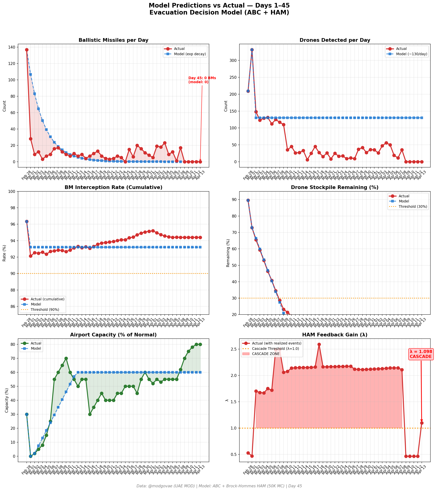

# 第45天更新 — 2026年4月13日

> 🌐 [English](../../updates/day45-april13.md) | **中文**

**状态：不稳定** | **突破：2/5** | **λ中位数 = 1.101**

---

## 新数据

| 指标 | 第44天 | 第45天 | 累计 |
|------|-------|-------|------|
| 弹道导弹 | 0 | **0** | **536** |
| 弹道导弹拦截 | 0 | 0 | 506 |
| 无人机探测 | 0 | ~0 | ~2362 |
| 无人机拦截 | 0 | 0 | ~2172 |
| 巡航导弹 | 0 | 0 | 19 |
| 弹道导弹拦截率（累计） | — | — | 94.4% |
| 无人机库存剩余 | — | — | -18.1%（-362/2000） |

**关键事件：**
- Ceasefire Day 5: Fifth consecutive zero-attack day; no BMs, drones, or cruise missiles — ceasefire technically holds despite political collapse
- US NAVAL BLOCKADE TAKES EFFECT: At 10 AM ET, US military blockade of Iranian ports in Strait of Hormuz begins — US Navy preventing all ships from entering/exiting Iranian ports. Trump warns Iran 'attack ships to stay away' (CNBC, CNN, FDD)
- HORMUZ EFFECTIVELY RE-CLOSED: Commercial shipping halts as blockade enforced; only ~3 vessels transited Monday (down from 12 Sunday); blockade costs Iran ~$435M/day in economic damage (CNBC, Fortune, FDD)
- OIL SURGES ~8%: Brent jumps to ~$101.82 (+6.95% from Friday); WTI surges to ~$103 — both top $100/bbl again. Markets fear prolonged energy crisis. Oil nearing $100 'as US Navy blockades Iran's ports' (Trading Economics, Fortune, CNN, CNBC)
- Iran's army calls blockade 'piracy'; threatens to turn Hormuz into 'graveyard for American ships'. Hezbollah rejects Israel talks, signaling wider escalation (Al Jazeera)
- GLOBAL MARKET IMPACT: Stock markets initially drop then partially recover; S&P gains despite tensions (CBC News). Energy crisis deepens — analysts warn blockade could push oil to $120+ (CNBC)
- DXB ~80% capacity: Operations stable; airlines adjusting schedules ahead of April 20 foreign carrier caps (IBTimes, Time Out Dubai)
- Polymarket: ceasefire extension to Apr 21 drops further to ~45%; markets pricing high probability ceasefire collapses when 2-week window expires ~Apr 21
- VLCC rates surge to ~$380K/day on blockade; tanker owners demand war-risk premiums for any Gulf transit
- Cumulative (official): 537 BMs, 26 cruise missiles, 2,256 drones; ~13 dead, ~230 injured (unchanged — fifth consecutive zero-casualty day)

---

## Lambda重新计算

```
λ = 1.0
  + λ_发射装置         = -0.544
  + λ_无人机          = +0.236
  + λ_拦截           = +0.000
  + λ_霍尔木兹         = +0.630
  + λ_代理人          = +0.000
  + λ_武器           = +0.000
  + λ_弹道反弹         = +0.000
  + λ_海军威慑         = -0.240
  ────────────────────────────
  λ 中位数       = 1.101（50K蒙特卡罗）
```

| 指标 | 数值 |
|------|------|
| λ 中位数 | **1.101** |
| λ 第95百分位 | **1.515** |
| P(λ > 1.0) | **67.3%** |
| P(λ > 1.5) | **5.2%** |
| P(λ > 2.0) | **2.4%** |
| 判定 | **不稳定** |
| 突破数 | **2/5** |

---

## 图表




---

## 建议

**撤离。** 系统已跨越级联阈值。

---

## 数据来源

| 来源 | 类型 |
|------|------|
| @modgovae (X.com) | 阿联酋国防部每日更新 |
| 模型管线 | ABC + HAM (50K MC) |
| 生成时间 | 2026-04-13 12:43 |
