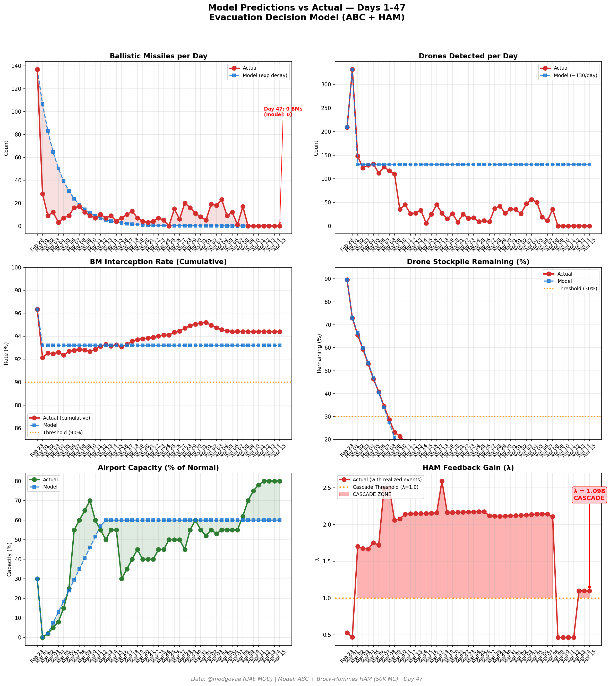
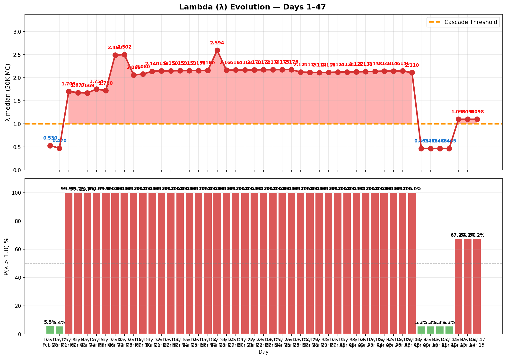

# 第47天更新 — 2026年4月15日

> 🌐 [English](../../updates/day47-april15.md) | **中文**

**状态：不稳定** | **突破：2/5** | **λ中位数 = 1.101**

---

## 新数据

| 指标 | 第46天 | 第47天 | 累计 |
|------|-------|-------|------|
| 弹道导弹 | 0 | **0** | **536** |
| 弹道导弹拦截 | 0 | 0 | 506 |
| 无人机探测 | 0 | ~0 | ~2362 |
| 无人机拦截 | 0 | 0 | ~2172 |
| 巡航导弹 | 0 | 0 | 19 |
| 弹道导弹拦截率（累计） | — | — | 94.4% |
| 无人机库存剩余 | — | — | -18.1%（-362/2000） |

**关键事件：**
- Ceasefire Day 7: Seventh consecutive zero-attack day; ceasefire holds despite political complexity
- IN-PRINCIPLE EXTENSION AGREEMENT: US and Iran have 'in-principle agreement' to extend ceasefire per regional officials (AP); however US officially states it has not formally agreed to extension (Jerusalem Post)
- PAKISTANI ARMY CHIEF IN TEHRAN: Gen. Asim Munir arrives in Tehran delivering US message to Iranian leadership; White House 'optimistic' about Iran deal (CNN, CNBC)
- SECOND ROUND TALKS IMMINENT: Second round of Islamabad talks 'very likely' next week per senior Pakistani officials (CNBC); US officials say both sides 'inch toward framework deal' (Axios)
- Trump says Iran war 'close to over' (CBS News); Hegseth separately urges Iran to 'choose wisely', says US is 'reloading' (ABC7)
- Iran warns US naval blockade threatens ceasefire (Al Jazeera); key sticking points: Hormuz sovereignty, nuclear program, war damage compensation
- HORMUZ: US naval blockade continues; ~9-10 total ship crossings this week; VLCC rates ~$395K/day (CNBC factbox); EIA boosts 2026 Brent projection to $96 (Rigzone)
- OIL: WTI ~$91.8/bbl, Brent ~$95.5 — prices easing on diplomatic optimism; 'possible US-Iran talks revive hopes of easing Hormuz tensions' (CNBC)
- DXB ~80%: 124 flights delayed, 22 cancelled across Dubai/Abu Dhabi; Emirates ~145-150 departures/day to ~125 destinations (~70% of normal)
- Polymarket: ceasefire extension by Apr 21 rises to 78% (from 71% Day 46); general ceasefire sentiment ~68%; conflict ends by Dec at ~95%
- Cumulative (official): 537 BMs, 26 cruise missiles, 2,256 drones; ~13 dead, ~230 injured (unchanged — seventh consecutive zero-casualty day)

---

## Lambda重新计算

```
λ = 1.0
  + λ_发射装置         = -0.544
  + λ_无人机          = +0.236
  + λ_拦截           = +0.000
  + λ_霍尔木兹         = +0.630
  + λ_代理人          = +0.000
  + λ_武器           = +0.000
  + λ_弹道反弹         = +0.000
  + λ_海军威慑         = -0.240
  ────────────────────────────
  λ 中位数       = 1.101（50K蒙特卡罗）
```

| 指标 | 数值 |
|------|------|
| λ 中位数 | **1.101** |
| λ 第95百分位 | **1.515** |
| P(λ > 1.0) | **67.3%** |
| P(λ > 1.5) | **5.2%** |
| P(λ > 2.0) | **2.4%** |
| 判定 | **不稳定** |
| 突破数 | **2/5** |

---

## 图表





---

## 建议

**撤离。** 系统已跨越级联阈值。

---

## 数据来源

| 来源 | 类型 |
|------|------|
| @modgovae (X.com) | 阿联酋国防部每日更新 |
| 模型管线 | ABC + HAM (50K MC) |
| 生成时间 | 2026-04-16 23:33 |
