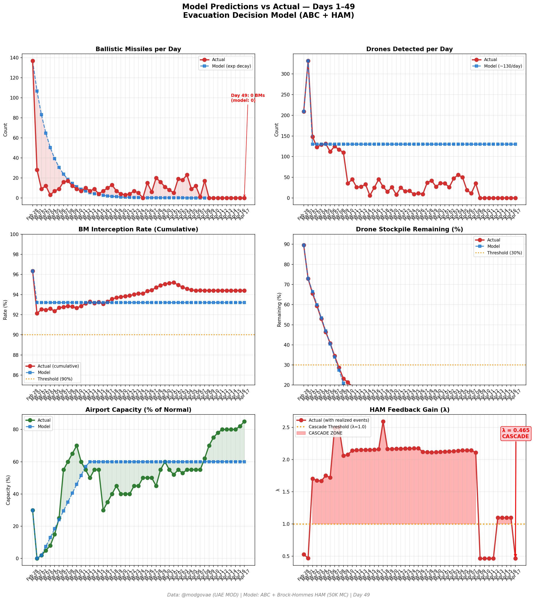

# 第49天更新 — 2026年4月17日

> 🌐 [English](../../updates/day49-april17.md) | **中文**

**状态：亚稳态** | **突破：2/5** | **λ中位数 = 0.463**

---

## 新数据

| 指标 | 第48天 | 第49天 | 累计 |
|------|-------|-------|------|
| 弹道导弹 | 0 | **0** | **536** |
| 弹道导弹拦截 | 0 | 0 | 506 |
| 无人机探测 | 0 | ~0 | ~2362 |
| 无人机拦截 | 0 | 0 | ~2172 |
| 巡航导弹 | 0 | 0 | 19 |
| 弹道导弹拦截率（累计） | — | — | 94.4% |
| 无人机库存剩余 | — | — | -18.1%（-362/2000） |

**关键事件：**
- 停火第9天：连续第9天零攻击日；停火在4月22日到期前维持
- 重大——霍尔木兹宣布开放：伊朗外长宣布霍尔木兹海峡"在停火剩余期间向所有商船完全开放"（半岛电视台实时博客）；伊朗承诺与以色列-黎巴嫩平行停火挂钩
- 黎巴嫩停火开始：10天以色列-黎巴嫩停火周四当地时间下午5点生效；内塔尼亚胡称以色列将在停火期间占领"安全地带"（The National、NBC News、CBS News）
- 特朗普施压：特朗普对记者表示"如未达协议，战斗恢复"——在4月22日停火到期前加码施压（NBC News）
- 阿联酋"取得胜利"：阿联酋表示已从一场它"力图避免"的战争中"取得胜利"；外交部重申伊朗恪守停止攻击和航行自由的重要性（mofa.gov.ae）
- 霍尔木兹：伊朗宣言引发商业通行激增；今日约14艘船通过 vs 昨日9艘；VLCC费率在风险溢价下降时回落至约$360K/天
- 油价：Brent ~$96（在霍尔木兹开放上回落）；WTI ~$94.5（回吐周三/周四4%涨幅的部分）；市场定价下行供应中断概率
- DXB复苏加速：IBTimes："迪拜国际机场今日开放：DXB航班持续增加，4月17日恢复加速"；阿联酋航空+flydubai每日出发航班超220；flydubai 100+航线（~冲突前40%），阿联酋航空125/140个目的地
- Polymarket：4月21日停火延期~69%（从78%小幅回落，因巴基斯坦斡旋暂停）；霍尔木兹开放+黎巴嫩停火信号推动一般停火情绪升至~72%
- 美国航母：3个航母打击群仍在该地区——USS Abraham Lincoln（阿拉伯海）、USS Gerald R. Ford（红海）、USS George H.W. Bush（中央司令部责任区）；尽管伊朗开放宣言，封锁态势仍在持续
- 累计（官方，不变）：537枚弹道导弹，26枚巡航导弹，2,256架无人机；约13死，约230伤（连续第9天零伤亡）

---

## Lambda重新计算

```
λ = 1.0
  + λ_发射装置         = -0.544
  + λ_无人机          = +0.236
  + λ_拦截           = +0.000
  + λ_霍尔木兹         = +0.000
  + λ_代理人          = +0.000
  + λ_武器           = +0.000
  + λ_弹道反弹         = +0.000
  + λ_海军威慑         = -0.240
  ────────────────────────────
  λ 中位数       = 0.463（50K蒙特卡罗）
```

| 指标 | 数值 |
|------|------|
| λ 中位数 | **0.463** |
| λ 第95百分位 | **1.010** |
| P(λ > 1.0) | **5.1%** |
| P(λ > 1.5) | **2.0%** |
| P(λ > 2.0) | **0.3%** |
| 判定 | **亚稳态** |
| 突破数 | **2/5** |

---

## 图表




---

## 建议

**监测。** 系统在正常参数范围内。

---

## 数据来源

| 来源 | 类型 |
|------|------|
| @modgovae (X.com) | 阿联酋国防部每日更新 |
| 模型管线 | ABC + HAM (50K MC) |
| 生成时间 | 2026-04-17 15:07 |
