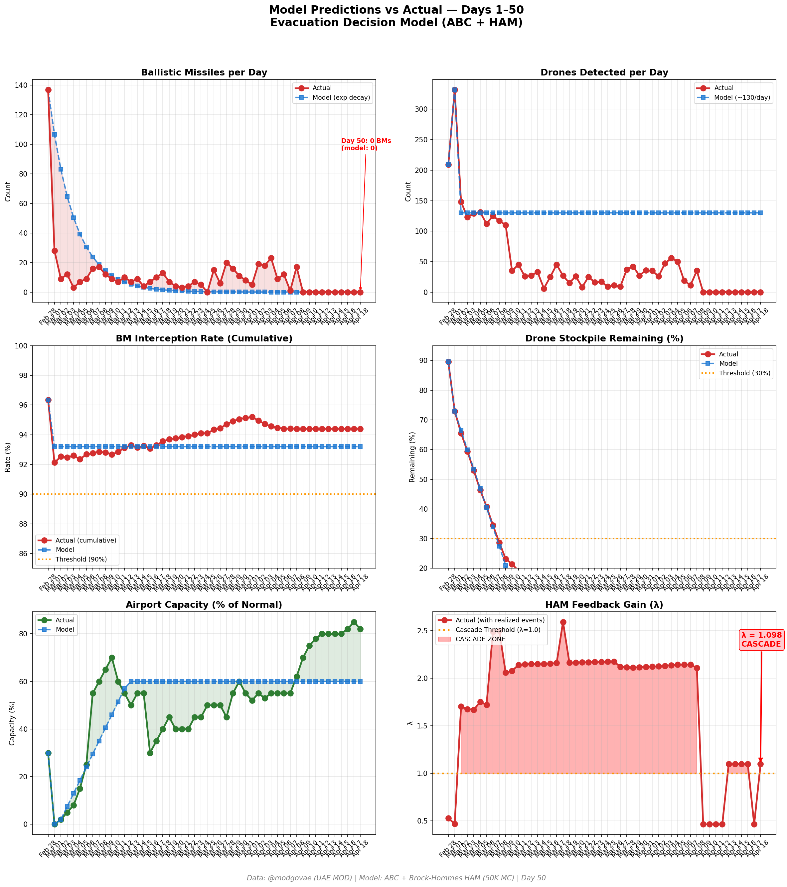
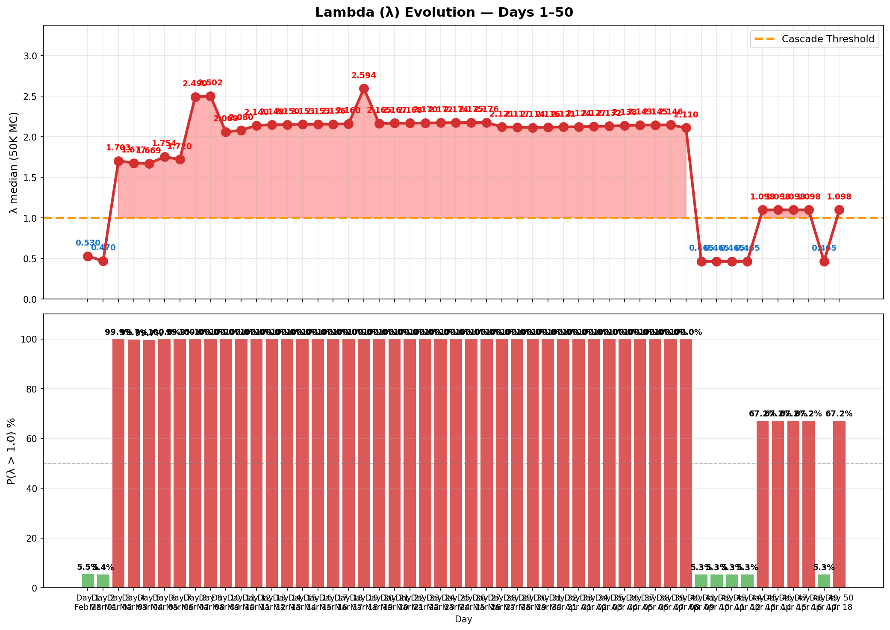

# 第50天更新 — 2026年4月18日

> 🌐 [English](../../updates/day50-april18.md) | **中文**

**状态：不稳定** | **突破：2/5** | **λ中位数 = 1.101**

---

## 新数据

| 指标 | 第49天 | 第50天 | 累计 |
|------|-------|-------|------|
| 弹道导弹 | 0 | **0** | **536** |
| 弹道导弹拦截 | 0 | 0 | 506 |
| 无人机探测 | 0 | ~0 | ~2362 |
| 无人机拦截 | 0 | 0 | ~2172 |
| 巡航导弹 | 0 | 0 | 19 |
| 弹道导弹拦截率（累计） | — | — | 94.4% |
| 无人机库存剩余 | — | — | -18.1%（-362/2000） |

**关键事件：**
- Ceasefire Day 10: Tenth consecutive zero-attack day on UAE; ceasefire technically holds despite Hormuz reversal
- MAJOR REVERSAL — IRAN RE-CLOSES HORMUZ: Iran's Supreme National Security Council announces Strait of Hormuz 'returned to its previous state' — reversing Day 49's opening declaration within 24 hours. Tehran cites US refusal to lift naval blockade of Iranian ports as justification (OPB, PBS, Al Jazeera, ABC News)
- IRGC GUNBOATS FIRE ON TANKER: UKMTO reports two IRGC gunboats approached a tanker ~20 nautical miles off Oman coast and opened fire without radio warning; tanker and crew reported safe (BSS News, RedState, Tribune India)
- IRAN CALLS BLOCKADE 'VIOLATION' OF CEASEFIRE: Supreme National Security Council statement says Iran 'determined to enforce monitoring and control over transit through Strait of Hormuz until definitive end of war'; will prevent 'any conditional and limited reopening' while blockade continues (Irish Times, Al Jazeera)
- CENTCOM APACHES OVER HORMUZ: US releases images of AH-64 Apache helicopters operating over Strait of Hormuz as Iran reimposes restrictions — maritime and airspace posture tightens (The Aviationist)
- TRUMP RATCHETS PRESSURE: Trump says US blockade will continue and 'attacks could resume if no agreement reached before ceasefire expires next week' (Apr 22) — maximum pressure going into final stretch (NBC News, Al Jazeera)
- IRAN STUDYING FRESH US PROPOSALS: Despite Hormuz reclosure, Tehran reports reviewing new US proposals delivered via Pakistani mediators — negotiations not fully collapsed (Irish Times, ABC News)
- HORMUZ: Strait effectively closed again; crossings collapse to ~4 vs 14 on Day 49; VLCC rates surge back to ~$400K/day on renewed war-risk premiums
- OIL REBOUNDS: Brent rebounds to ~$97.18 (from ~$96 Thu); WTI ~$93 (from ~$94.5) — markets re-pricing supply disruption risk after brief Day-49 relief (Angle360ng, Convex, oilpriceapi.com)
- DXB OPEN: Dubai International Airport remains fully open and operational on Saturday across all three terminals but continues reduced schedule; Emirates + flydubai operating, airport at ~82% capacity as recovery cautiously accelerates (IBTimes, Dubai Airports)
- Polymarket: Ceasefire extension by Apr 21 at ~74% (vs ~69% Day 49); general ceasefire sentiment drops to ~62% on Hormuz reversal and tanker attack
- 3 US CSGs remain in region (Lincoln, Ford, George H.W. Bush) maintaining blockade posture; ~27 Navy vessels engaged
- Cumulative (official, unchanged): 537 BMs, 26 cruise missiles, 2,256 drones; ~13 dead, ~230 injured (tenth consecutive zero-casualty day)

---

## Lambda重新计算

```
λ = 1.0
  + λ_发射装置         = -0.544
  + λ_无人机          = +0.236
  + λ_拦截           = +0.000
  + λ_霍尔木兹         = +0.630
  + λ_代理人          = +0.000
  + λ_武器           = +0.000
  + λ_弹道反弹         = +0.000
  + λ_海军威慑         = -0.240
  ────────────────────────────
  λ 中位数       = 1.101（50K蒙特卡罗）
```

| 指标 | 数值 |
|------|------|
| λ 中位数 | **1.101** |
| λ 第95百分位 | **1.515** |
| P(λ > 1.0) | **67.3%** |
| P(λ > 1.5) | **5.2%** |
| P(λ > 2.0) | **2.4%** |
| 判定 | **不稳定** |
| 突破数 | **2/5** |

---

## 图表





---

## 建议

**撤离。** 系统已跨越级联阈值。

---

## 数据来源

| 来源 | 类型 |
|------|------|
| @modgovae (X.com) | 阿联酋国防部每日更新 |
| 模型管线 | ABC + HAM (50K MC) |
| 生成时间 | 2026-04-19 13:18 |
