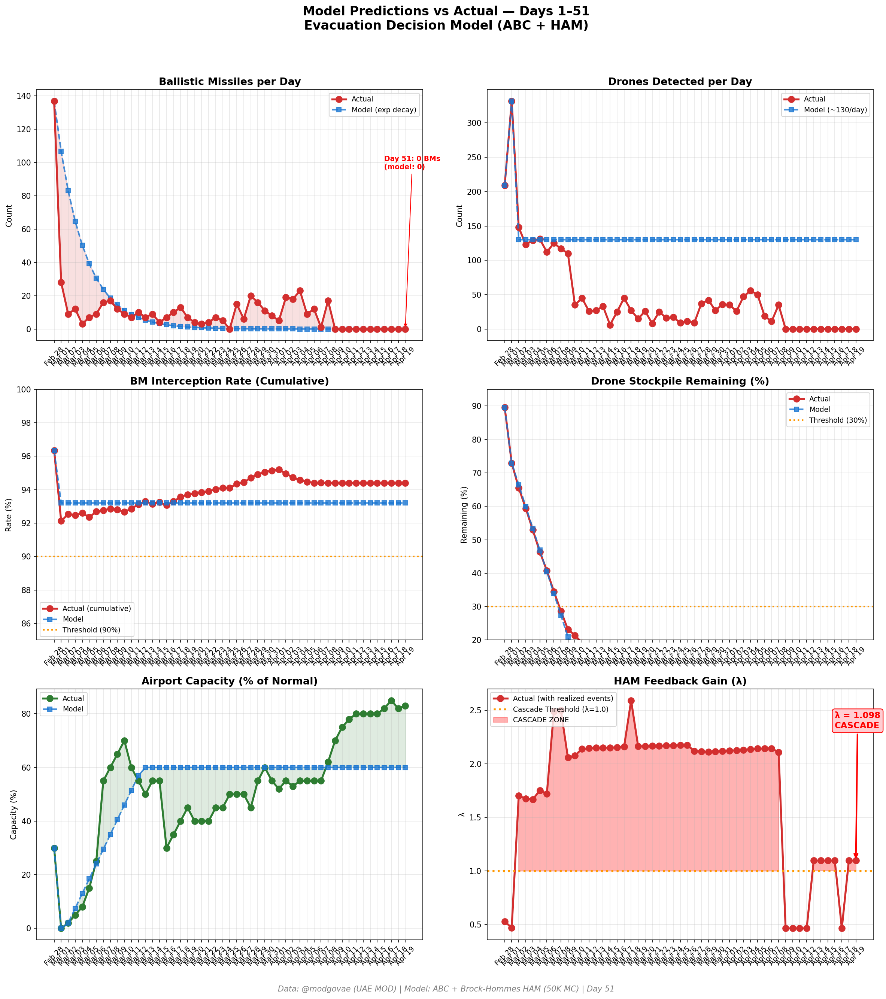
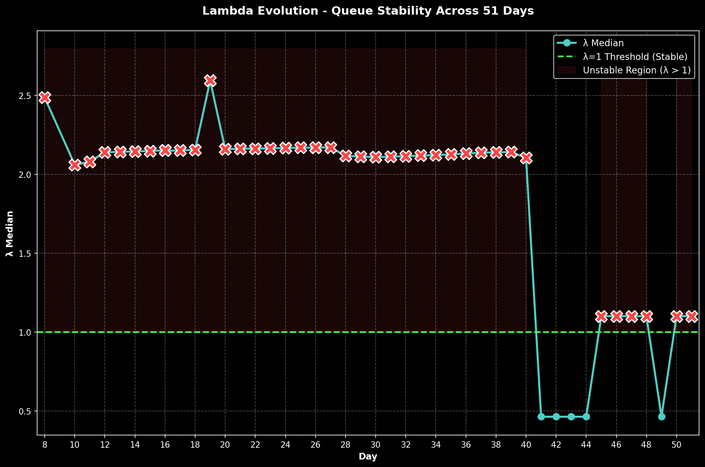

# 第51天更新 — 2026年4月19日

> 🌐 [English](../../updates/day51-april19.md) | **中文**

**状态：不稳定** | **突破：2/5** | **λ中位数 = 1.101**

---

## 新数据

| 指标 | 第50天 | 第51天 | 累计 |
|------|-------|-------|------|
| 弹道导弹 | 0 | **0** | **536** |
| 弹道导弹拦截 | 0 | 0 | 506 |
| 无人机探测 | 0 | ~0 | ~2362 |
| 无人机拦截 | 0 | 0 | ~2172 |
| 巡航导弹 | 0 | 0 | 19 |
| 弹道导弹拦截率（累计） | — | — | 94.4% |
| 无人机库存剩余 | — | — | -18.1%（-362/2000） |

**关键事件：**
- Ceasefire Day 11: Eleventh consecutive zero-attack day on UAE; ceasefire holds as Apr 22 expiry approaches (3 days remaining)
- HORMUZ CRISIS CONTINUES: Strait remains under Iranian 'strict control' for second day; no meaningful opening; IRGC maintains restrictions until US lifts naval blockade
- UAE 'EMERGED VICTORIOUS' MESSAGING: Anwar Gargash (UAE presidential diplomatic adviser) reiterates UAE 'triumphed in war we sincerely sought to avoid' via X — shifts to post-war strategic framing (Al Jazeera)
- IRAN REVIEWING US PROPOSALS: Tehran continues studying latest US proposals delivered through Pakistani mediation; Pakistani Army Chief Gen. Asim Munir remains in Tehran coordinating; second-round Islamabad talks still 'very likely' before Apr 22 expiry (Al Jazeera, Time)
- TRUMP PRESSURE HOLDS: Trump maintains stance that US blockade stays and 'fighting resumes' without deal; both sides in final-stretch posturing
- HORMUZ: ~4 ship crossings (unchanged from Day 50); VLCC rates edge up to ~$405K/day on extended blockade uncertainty; P&I clubs maintain war-risk cover suspensions
- OIL: Brent ~$97, WTI ~$93.5 — prices stable at elevated levels; markets holding supply-risk premium while awaiting Apr 22 outcome
- DXB STEADY: Dubai International Airport operating normally with reduced schedule; capacity ~83%; Emirates+flydubai >220 daily departures; EASA conflict-zone bulletin extended to Apr 24; foreign carrier one-rotation cap remains in effect from Apr 20
- Polymarket: Ceasefire extension by Apr 21 at ~74% (unchanged); general ceasefire sentiment ~63% (slight uptick from Day 50 reversal panic); conflict-ends-by-Dec at ~95%
- US CARRIERS: 3 CSGs remain on station (Abraham Lincoln, Gerald R. Ford, George H.W. Bush); blockade enforcement continues; ~27 Navy vessels deployed
- Cumulative (official, unchanged): 537 BMs, 26 cruise missiles, 2,256 drones; ~13 dead, ~230 injured (eleventh consecutive zero-casualty day)

---

## Lambda重新计算

```
λ = 1.0
  + λ_发射装置         = -0.544
  + λ_无人机          = +0.236
  + λ_拦截           = +0.000
  + λ_霍尔木兹         = +0.630
  + λ_代理人          = +0.000
  + λ_武器           = +0.000
  + λ_弹道反弹         = +0.000
  + λ_海军威慑         = -0.240
  ────────────────────────────
  λ 中位数       = 1.101（50K蒙特卡罗）
```

| 指标 | 数值 |
|------|------|
| λ 中位数 | **1.101** |
| λ 第95百分位 | **1.515** |
| P(λ > 1.0) | **67.3%** |
| P(λ > 1.5) | **5.2%** |
| P(λ > 2.0) | **2.4%** |
| 判定 | **不稳定** |
| 突破数 | **2/5** |

---

## 图表





---

## 建议

**撤离。** 系统已跨越级联阈值。

---

## 数据来源

| 来源 | 类型 |
|------|------|
| @modgovae (X.com) | 阿联酋国防部每日更新 |
| 模型管线 | ABC + HAM (50K MC) |
| 生成时间 | 2026-04-19 13:18 |
