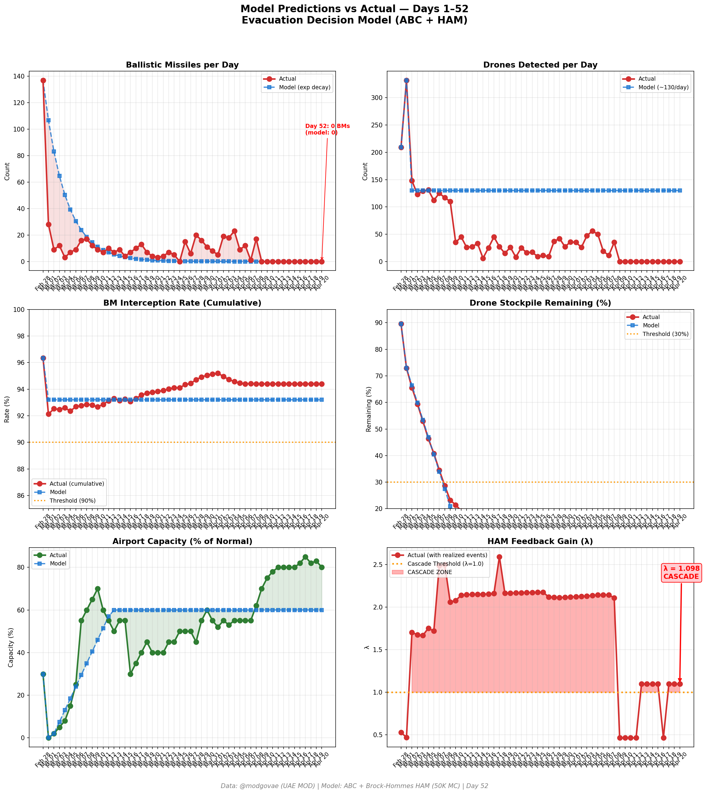
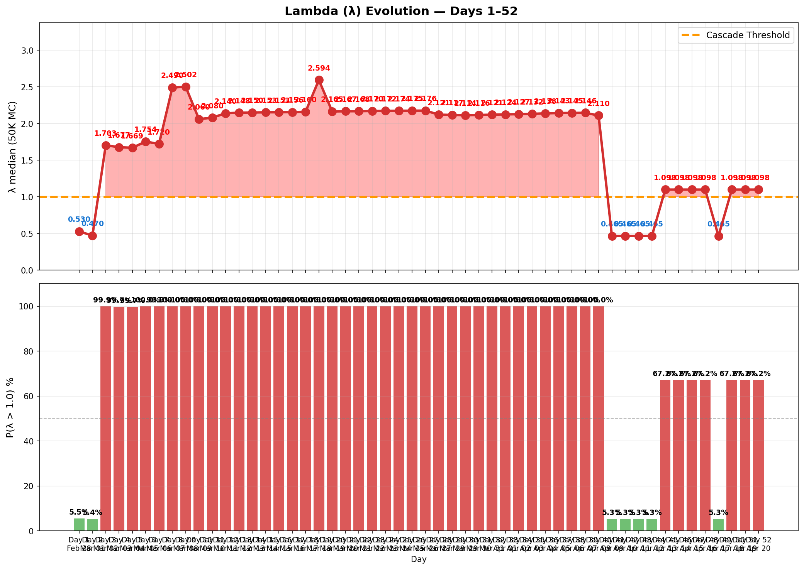

# 第52天更新 — 2026年4月20日

> 🌐 [English](../../updates/day52-april20.md) | **中文**

**状态：不稳定** | **突破：2/5** | **λ中位数 = 1.101**

---

## 新数据

| 指标 | 第51天 | 第52天 | 累计 |
|------|-------|-------|------|
| 弹道导弹 | 0 | **0** | **536** |
| 弹道导弹拦截 | 0 | 0 | 506 |
| 无人机探测 | 0 | ~0 | ~2362 |
| 无人机拦截 | 0 | 0 | ~2172 |
| 巡航导弹 | 0 | 0 | 19 |
| 弹道导弹拦截率（累计） | — | — | 94.4% |
| 无人机库存剩余 | — | — | -18.1%（-362/2000） |

**关键事件：**
- Ceasefire Day 12: Twelfth consecutive zero-attack day on UAE; ceasefire technically holds but strains visibly before April 22 expiry
- MAJOR — US SEIZES IRANIAN VESSEL: News broke Monday that US Navy seized an Iranian-flagged container ship near Strait of Hormuz Sunday in Gulf of Oman; Tehran vows 'swift retaliation' and accuses US of ceasefire violation (NBC News, NPR, CNN, Washington Post)
- TRUMP — EXTENSION 'HIGHLY UNLIKELY': Trump tells reporters the two-week ceasefire will end 'Wednesday evening Washington time' and an extension is 'highly unlikely' if no deal is reached; maximum-pressure posture continues (CNN live)
- VANCE HEADED TO PAKISTAN: VP JD Vance to depart Washington Tuesday for Pakistan to take part in Wednesday round-two talks with Iran (CNN, NBC News)
- UAE SCHOOLS REOPEN: UAE Ministry of Education announces in-person classes resume April 20 across public/private schools following 'completion of necessary readiness and preparation plans' — first major normalization step since late February (Bloomberg)
- DXB FOREIGN-CARRIER CAP LIVE: Dubai enforces one-daily-roundtrip cap on foreign airlines at DXB and Al Maktoum International starting April 20 through May 31; Emirates/flydubai continue reduced schedules
- HORMUZ: Strait remains under Iranian 'strict control'; 16 ships traversed Monday per tracking data, including two Iranian-flagged vessels entering and one exiting; VLCC rates tick higher to ~$420K/day on renewed war-risk premia
- OIL JUMPS: WTI +6.8% to $89.61/bbl; Brent +5.6% to $95.48/bbl on ship seizure and Trump's ceasefire-end language; market re-prices probability of resumption of hostilities (CNBC, CNN Business, Axios)
- Polymarket: Ceasefire extension by Apr 21 market slides; general ceasefire sentiment drops to ~58% (from ~63% Day 51) on ship-seizure escalation and Trump's 'highly unlikely extension' remarks
- US CARRIERS: 3 CSGs remain on station (USS Abraham Lincoln Arabian Sea, USS Gerald R. Ford Red Sea, USS George H.W. Bush CENTCOM AOR); ~27 Navy vessels deployed; Apaches continue over Hormuz
- Cumulative (official, unchanged): 537 BMs, 26 cruise missiles, 2,256 drones; ~13 dead, ~230 injured (twelfth consecutive zero-casualty day)

---

## Lambda重新计算

```
λ = 1.0
  + λ_发射装置         = -0.544
  + λ_无人机          = +0.236
  + λ_拦截           = +0.000
  + λ_霍尔木兹         = +0.630
  + λ_代理人          = +0.000
  + λ_武器           = +0.000
  + λ_弹道反弹         = +0.000
  + λ_海军威慑         = -0.240
  ────────────────────────────
  λ 中位数       = 1.101（50K蒙特卡罗）
```

| 指标 | 数值 |
|------|------|
| λ 中位数 | **1.101** |
| λ 第95百分位 | **1.515** |
| P(λ > 1.0) | **67.3%** |
| P(λ > 1.5) | **5.2%** |
| P(λ > 2.0) | **2.4%** |
| 判定 | **不稳定** |
| 突破数 | **2/5** |

---

## 图表





---

## 建议

**撤离。** 系统已跨越级联阈值。

---

## 数据来源

| 来源 | 类型 |
|------|------|
| @modgovae (X.com) | 阿联酋国防部每日更新 |
| 模型管线 | ABC + HAM (50K MC) |
| 生成时间 | 2026-04-21 11:59 |
