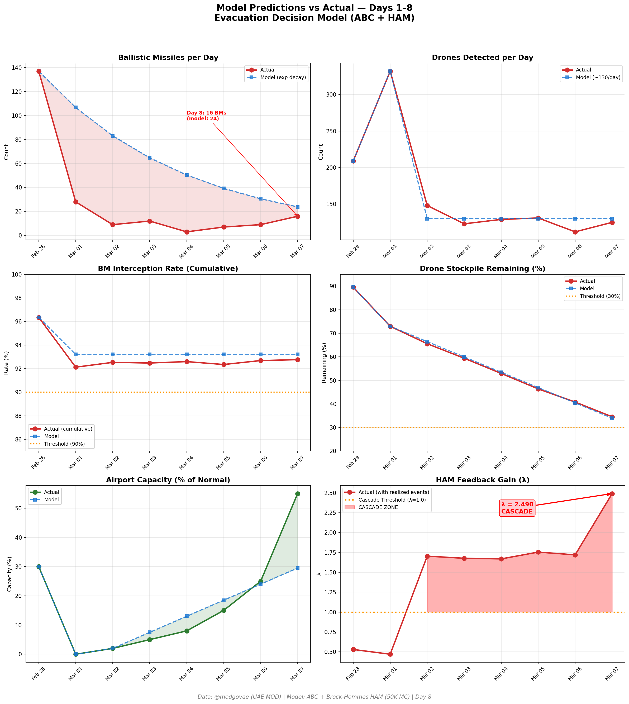
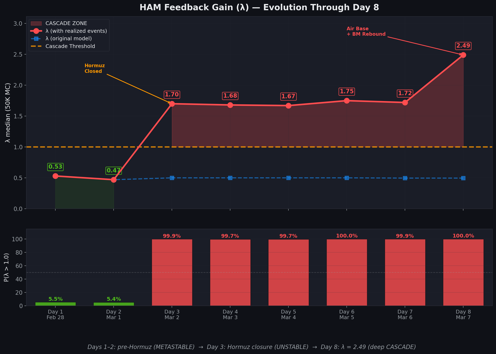

# 第8天更新 — 2026年3月7日

> 🌐 [English](../../updates/day8-march7.md) | **中文**

**状态：不稳定** | **突破：2/5** | **λ中位数 = 2.488**

---

## 新数据

| 指标 | 第7天 | 第8天 | 累计 |
|------|-------|-------|------|
| 弹道导弹 | 9 | **16** | **221** |
| 弹道导弹拦截 | 9 | 15 | 205 |
| 无人机探测 | 112 | ~125 | ~1309 |
| 无人机拦截 | 109 | 119 | ~1254 |
| 巡航导弹 | 0 | 0 | 8 |
| 弹道导弹拦截率（累计） | — | — | 92.8% |
| 无人机库存剩余 | — | — | 34.5%（691/2000） |

**关键事件：**
- 16 BMs detected — highest since Day 2
- IRGC claims Al Dhafra air base strike
- Dubai shelter-in-place alert 7:05 PM
- Emirates 60% network, 106 flights/day

---

## Lambda重新计算

```
λ = 1.0
  + λ_发射装置         = -0.413
  + λ_无人机          = +0.131
  + λ_拦截           = +0.001
  + λ_霍尔木兹         = +0.630
  + λ_代理人          = +0.500
  + λ_武器           = +0.400
  + λ_弹道反弹         = +0.300
  + λ_海军威慑         = -0.184
  ────────────────────────────
  λ 中位数       = 2.488（50K蒙特卡罗）
```

| 指标 | 数值 |
|------|------|
| λ 中位数 | **2.488** |
| λ 第95百分位 | **3.206** |
| P(λ > 1.0) | **100.0%** |
| P(λ > 1.5) | **100.0%** |
| P(λ > 2.0) | **92.6%** |
| 判定 | **不稳定** |
| 突破数 | **2/5** |

---

## 图表





---

## 建议

**立即撤离。** 系统处于级联区域。

---

## 数据来源

| 来源 | 类型 |
|------|------|
| @modgovae (X.com) | 阿联酋国防部每日更新 |
| 模型管线 | ABC + HAM (50K MC) |
| 生成时间 | 2026-03-07 16:03 |
